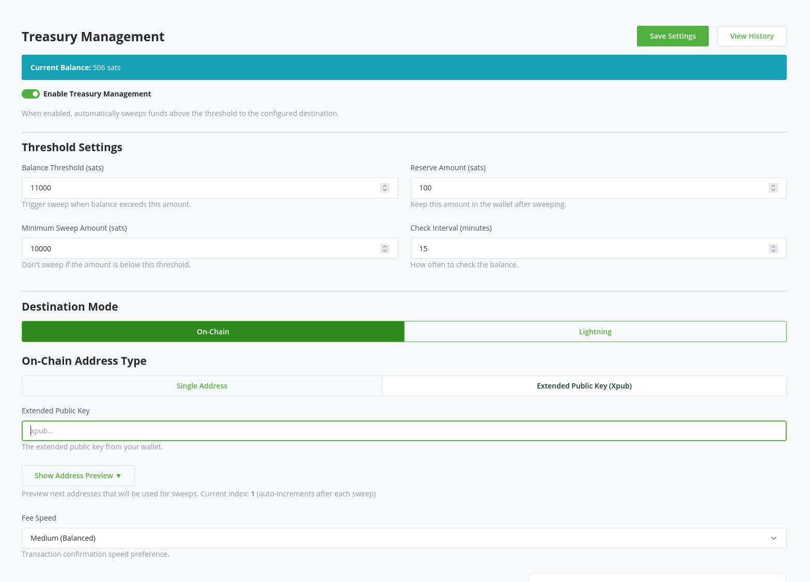

 I've covered the creation of new [lightning network backend plugin for BTCPay server](https://github.com/aljazceru/btcpayserver-breez-nodeless-spark) in the previous post so if you want a long winded post about it [read it there](https://disobey.dev/posts/lightweight-lightning-backends-or-lets-fight-about-spark/). This is part 2, primarily focusing on the new improvement I've added to it - automated treasury management. 

Spark's security model (statechain) is not everyones favorite cup of it. Its not even mine favorite cup of tea. But I like the simplicity. And after spending years on purity discussions about LN approaches I'm past them. Because I really don't care about yet another screaming cunt saying that this is bad. It solves an issue. The issue being that I don't want to deal with liquidity all the time. Or expose my somewhat decently sized routing node to every piece of software under the sun. Or run tons of nodes just for the sake of separating things apart. 

Anyway, before this turns into another rant lets get to what I really wanted to show.

## Treasury management
 
As promised in the previous post I've finally added automated treasury management. That enables you to configure the level of exposure you want to have on your btcpay instance (or spark) and either automatically send the overflowing balance to another lightning address or L1 address.

It supports either adding an xpub or a static address. Static address is mostly there as an ad hoc solution for any poor soul who wants to send this anywhere that they would want to reuse an address (khm, exchange, khm). 

This way you can automatically move your earnings to cold storage or send it to a different lightning wallet (that has a lightning address), like your spending wallet for example.

If you have and feedback/wishes about future functionality you're welcome to [open an issue](https://github.com/aljazceru/btcpayserver-breez-nodeless-spark) or find a different avenue to bug me about it.