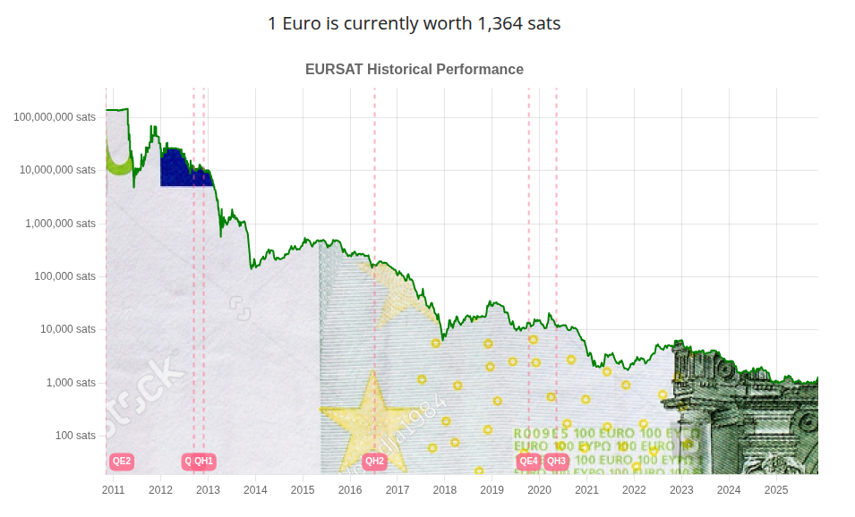

I've stumbled upon [Bitkarrot](https://nostree.me/bitkarrot@nostr.com)'s [repo](https://github.com/bitkarrot/satshkd-vercel) a while back and said to myself, "Why not visualize the Euro to Satoshi exchange rate over time?". As that was the 1337th side project idea I had, I managed to find the restraint to not start it immediately. But as luck would have it I got some free credits from Anthropic to try out their new Claude Code Web which meant that now I had a time sensitive excuse to build an EURO version of it (together with a bunch of other stuff, more on that in another post). 

This is what came out of it:

Turns out sourcing old data (pre 2013) gets a bit trickier (I was incredibly pleased with myself when I, for the sake of not hoarding TOO much data, decided to delete all my old market data that I've been hoarding from my days of active trading) but with some stichting together of old fx and btcusd data (and with a bit of help from friends that actually keep historical data archived and handy when one needs it) I managed to get a decent dataset going back to November 2010. 

Of course I didn't want to end jup with just a cheap clone of [usdsat.com](https://usdsat.com/) so I decided to spice the thing up a bit by adding some of the most relevant comments from our beloved friends at European Central Bank (ECB) to remind the viewer of the wisdom that great institution who has been entrusted with runining the lifelihood of millions of Europeans has bestowed upon us over the years. Its hard to pick the best one so I'll leave it to you to go to [eursat](https://eursat.eu/) and judge for yourself.